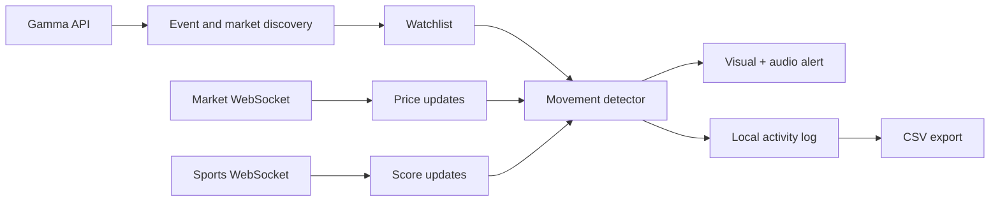

# Polymarket Goal Pulse

[简体中文](README.zh-CN.md)


**A browser-based movement radar for Polymarket.** Watch multiple markets in real time and get an immediate visual and audio alert when probabilities or sports scores move sharply.

[**Open the live dashboard →**](https://wandsgyu.github.io/polymarket-odds-visualizer/)

> Goal Pulse is a monitoring and research tool. It never places trades and is not financial advice.

## The idea

A market's current probability is useful, but the most actionable moment is often the change:

- a price moves several percentage points within seconds;
- a goal reprices a group of related sports outcomes;
- breaking news wakes up a previously quiet market;
- one market in a large watchlist suddenly becomes active.

Goal Pulse keeps those markets on one board, detects fast movement, and preserves the surrounding data for later inspection.

## Highlights

- **Live market data** from Polymarket's Market WebSocket.
- **Sports score signals** from the Sports WebSocket.
- **Multi-market watchlist** with all outcomes visible on one screen.
- **Configurable detection** for time window, percentage-point threshold, spread, and cooldown.
- **Persistent alerts** with sound, visual emphasis, and frozen alert packages.
- **Local research log** with configurable sampling and CSV export.
- **Five UI languages:** English, 中文, 日本語, 한국어, and Español.
- **Zero runtime dependencies:** plain HTML, CSS, and JavaScript.

## How it works



The browser talks directly to Polymarket's public data services. There is no local proxy, backend, account connection, or order-execution path.

## Quick start

### Use the hosted version

Open the [live dashboard](https://wandsgyu.github.io/polymarket-odds-visualizer/), then click **Test Alert** once so the browser can enable audio.

### Run locally

```bash
git clone https://github.com/WandsgYu/polymarket-odds-visualizer.git
cd polymarket-odds-visualizer
python3 -m http.server 5173 --bind 127.0.0.1
```

Open [http://127.0.0.1:5173](http://127.0.0.1:5173).

## Default detector settings

| Setting | Default | Purpose |
| --- | ---: | --- |
| Movement window | `1.5s` | Measures a fast probability move |
| Movement threshold | `8pp` | Minimum percentage-point change for an alert |
| Per-market cooldown | `20s` | Prevents repeated alerts from the same token |
| Maximum spread | `0.08` | Filters markets with excessive spread |
| Log interval | `2s` | Samples watched prices into the local log |

Settings, watchlists, alert summaries, and recent activity are stored in the current browser with `localStorage`.

## Typical workflow

1. Search for a Polymarket event.
2. Add one or more active CLOB markets to the watchlist.
3. Tune the movement window, threshold, cooldown, and spread filter.
4. Keep the dashboard open while following the event.
5. Inspect alert packages or export CSV data around a movement.

## Data sources

- **Gamma API** — event search, market metadata, token IDs, and initial prices.
- **Market WebSocket** — best bid/ask, price-change, and last-trade updates.
- **Sports WebSocket** — score and match-state signals.

Periodic Gamma refreshes recalibrate the displayed state and help recover after a WebSocket reconnect.

## Privacy and scope

- No sign-in or wallet connection is required.
- No watched markets or logs are uploaded by this project.
- Data remains in the current browser unless you export it.
- There is no trading, transaction signing, or notification backend.

## Current limitations

- Real-time monitoring requires active markets with CLOB token IDs.
- Sports score messages are supporting signals, not official result confirmation.
- Browser audio policies may require a user gesture before sound works.
- Browser storage is local and can be cleared by the user or browser.
- Telegram, Discord, email, and mobile push notifications are not implemented.

## Project structure

```text
index.html   # dashboard markup and controls
style.css    # responsive visual design
app.js       # data sources, watchlist, detection, alerts, i18n, and export
```

## Feedback

Bug reports and focused feature ideas are welcome in [GitHub Issues](https://github.com/WandsgYu/polymarket-odds-visualizer/issues).

## License

[MIT](LICENSE)
