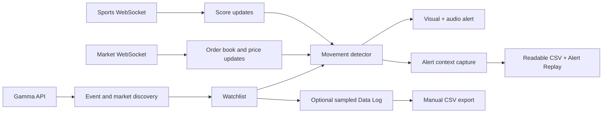

# Polymarket Goal Pulse

[简体中文](README.zh-CN.md)


**A browser-based movement radar for Polymarket.** Watch multiple markets in real time and get an immediate visual and audio alert when probabilities or sports scores change.

[**Open the live dashboard →**](https://wandsgyu.github.io/polymarket-odds-visualizer/)

> Goal Pulse is a monitoring and research tool. It never places trades and is not financial advice.

## Why Goal Pulse

A market's current probability is useful, but the most actionable moment is often the change:

- a price moves several percentage points within seconds;
- a goal reprices a group of related sports outcomes;
- breaking news wakes up a previously quiet market;
- one market in a large watchlist suddenly becomes active.

Goal Pulse keeps those markets on one board, detects fast movement, alerts you immediately, and preserves the relevant surrounding data for later inspection.

## Highlights

- **Live market data** from Polymarket's Market WebSocket.
- **Sports score signals** from the Sports WebSocket.
- **Multi-market watchlist** with all outcomes visible on one screen.
- **Configurable detection** for time window, percentage-point threshold, spread, and cooldown.
- **Persistent alerts** with sound and a visual overlay that continue until you close them.
- **Readable alert CSV** downloaded automatically with up to 10 seconds of relevant WebSocket data before and after an alert.
- **Alert Replay** with an in-page timeline and JSON export.
- **Local Data Log** with configurable sampling and manual CSV export.
- **Fullscreen monitoring board** for keeping the watched markets in focus.
- **Two UI languages:** English and 中文.
- **Zero runtime dependencies:** plain HTML, CSS, and JavaScript.

## How it works



The browser talks directly to Polymarket's public data services. There is no local proxy, backend, account connection, or order-execution path.

## Quick start

### Use the hosted version

Open the [live dashboard](https://wandsgyu.github.io/polymarket-odds-visualizer/).

- The dashboard starts with an automatic `FED` event search. Replace it with any event, team, or market keyword.
- Click **Test Alert** once to let the browser enable audio. The test also downloads a small sample alert CSV so you can verify the export flow.

### Run locally

```bash
git clone https://github.com/WandsgYu/polymarket-odds-visualizer.git
cd polymarket-odds-visualizer
python3 -m http.server 5173 --bind 127.0.0.1
```

Open [http://127.0.0.1:5173](http://127.0.0.1:5173).

## Typical workflow

1. Use the default `FED` results or search for another Polymarket event.
2. Select an event and add one or more active CLOB markets to the watchlist.
3. Tune the movement window, threshold, cooldown, and spread filter.
4. Optionally resume the sampled Data Log if you want continuous price samples.
5. Keep the dashboard open while following the event, or switch to fullscreen mode.
6. When an alert fires, inspect Alert Replay and the automatically downloaded readable CSV.

## Default detector settings

| Setting | Default | Purpose |
| --- | ---: | --- |
| Movement window | `1.5s` | Measures a fast probability move |
| Movement threshold | `8pp` | Minimum percentage-point change for an alert |
| Per-market cooldown | `20s` | Prevents repeated alerts from the same token |
| Maximum spread | `0.08` | Filters markets with excessive spread |
| Log interval | `2s` | Sampling interval used after the Data Log is resumed |

The sampled Data Log is **paused by default**. Click **Resume Log** to begin recording.

## Logs and exports

Goal Pulse has three separate research outputs:

| Output | Trigger | Contents | Lifetime and export |
| --- | --- | --- | --- |
| **Data Log** | Manually resumed | Periodic samples of watched outcomes and prices | Held in the current page session; manually exported as CSV |
| **Alert Context Log** | Automatic after an alert | The alert summary plus relevant WebSocket updates from up to 10 seconds before and after the alert | Automatically downloaded as `readable-alert-log-<time>.csv` |
| **Alert Replay** | Automatic after an alert | Alert summary and an in-page WebSocket message timeline | Viewable in the current page; the full package can be downloaded as JSON |

### Readable alert CSV

The alert CSV is designed to open as a normal table instead of placing an entire WebSocket object in one JSON cell. It:

- filters out unrelated market broadcasts;
- expands status snapshots and multi-asset price changes into separate rows;
- includes a dedicated alert summary row;
- separates time, alert phase, message type, event, market, outcome, price, size, best bid, best ask, spread, order-book depth, IDs, and a readable summary;
- currently exports 28 columns with UTF-8 encoding for direct spreadsheet viewing.

## Browser storage and persistence

The following values are stored in the current browser with `localStorage`:

- detector settings;
- watchlist and selected event;
- selected UI language and activity-panel state;
- compact alert summaries.

The following values are **not** fully persisted:

- the activity feed;
- sampled Data Log rows;
- complete pre-alert and post-alert WebSocket messages.

Refreshing or closing the page clears those session-only details. Export the CSV or JSON before refreshing if you need the complete record. Restored Alert Replay items retain their summaries but not the original message timeline.

## Data sources

- **Gamma API** — event search, market metadata, token IDs, and initial prices.
- **Market WebSocket** — `book`, `price_change`, `best_bid_ask`, and `last_trade_price` updates.
- **Sports WebSocket** — score and match-state signals.

Periodic Gamma refreshes recalibrate displayed prices and help recover after a WebSocket reconnect.

## Privacy and scope

- No sign-in or wallet connection is required.
- No watched markets or logs are uploaded by this project.
- Data remains in the current browser unless you export it.
- There is no trading, transaction signing, or notification backend.

## Current limitations

- Real-time monitoring requires active markets with CLOB token IDs.
- Sports score messages are supporting signals, not official result confirmation.
- Browser audio policies may require a user gesture before sound works.
- Full alert context and sampled logs are session-only unless exported.
- Alert capture can contain less than 10 seconds of pre-alert data when monitoring has only just started.
- Telegram, Discord, email, and mobile push notifications are not implemented.

## Project structure

```text
index.html     # dashboard markup and controls
style.css      # responsive visual design
app.js         # data sources, watchlist, detection, alerts, storage, and i18n
alert-csv.js   # alert-message filtering and readable CSV normalization
```

## Technical stack

- Plain HTML / CSS / JavaScript
- Polymarket Gamma API
- Polymarket CLOB Market WebSocket
- Polymarket Sports WebSocket
- Browser `localStorage`
- Web Audio API

## Feedback and contributions

Bug reports and focused feature ideas are welcome in [GitHub Issues](https://github.com/WandsgYu/polymarket-odds-visualizer/issues).

If this tool is useful, a GitHub Star is also appreciated.

## License

[MIT](LICENSE)
