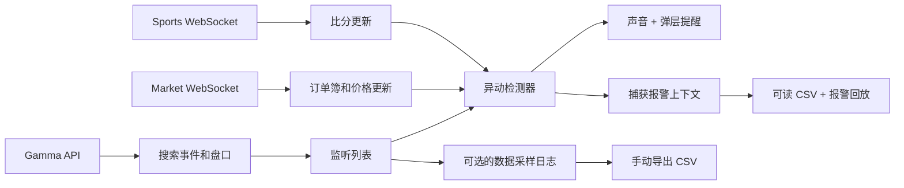

# Polymarket Goal Pulse

[English](README.md) | **简体中文**


**一个运行在浏览器里的 Polymarket 实时异动雷达。** 同时监听多个盘口，在概率或体育比分发生变化时立即通过声音和弹层提醒你。

[**打开在线版 →**](https://wandsgyu.github.io/polymarket-odds-visualizer/)

> Goal Pulse 是监控和研究工具，不会连接钱包、不会替你下单，也不构成投资建议。

## 为什么做这个项目

Polymarket 最有价值的信息往往不只是当前价格，而是价格刚刚发生了什么变化：

- 某个事件的概率在几秒内突然上涨；
- 比赛进球后，相关盘口快速重新定价；
- 突发新闻出现后，原本安静的市场开始异动；
- 大量监听项目中有一个盘口突然活跃。

Goal Pulse 把这些盘口集中到同一个看板，检测快速变化、立即提醒，并保存与报警相关的上下文数据供后续复盘。

## 核心功能

- **实时市场数据**：通过 Polymarket Market WebSocket 接收盘口变化。
- **体育比分信号**：通过 Sports WebSocket 接收比分和比赛状态。
- **多市场监听**：在同一个页面展示多个盘口及其全部结果。
- **可配置异动检测**：调整统计窗口、百分点阈值、最大价差和静默期。
- **持续报警**：声音和弹层会一直持续，直到手动关闭。
- **可读报警 CSV**：报警后自动下载，包含报警前后最多各 10 秒的相关 WebSocket 数据。
- **报警回放**：在页面内查看消息时间线，并可导出完整 JSON。
- **本地数据日志**：按指定间隔采样，手动导出 CSV。
- **全屏监听看板**：专注查看当前监听盘口。
- **双语界面**：支持 English 和中文。
- **零运行时依赖**：只使用原生 HTML、CSS 和 JavaScript。

## 工作原理



浏览器会直接访问 Polymarket 的公开数据服务。项目没有本地代理、后端服务、账户连接或自动下单路径。

## 立即使用

### 使用在线版

打开[在线版看板](https://wandsgyu.github.io/polymarket-odds-visualizer/)。

- 页面打开后会自动搜索 `FED`，你可以将它替换为任意事件、球队或盘口关键词。
- 第一次使用时点击“测试提醒”，让浏览器允许播放声音。测试提醒还会下载一份小型示例报警 CSV，用于确认导出流程正常。

### 本地运行

```bash
git clone https://github.com/WandsgYu/polymarket-odds-visualizer.git
cd polymarket-odds-visualizer
python3 -m http.server 5173 --bind 127.0.0.1
```

打开 [http://127.0.0.1:5173](http://127.0.0.1:5173)。

## 典型使用流程

1. 使用默认的 `FED` 搜索结果，或者搜索其他 Polymarket 事件。
2. 选择事件，将一个或多个活跃的 CLOB 盘口加入监听列表。
3. 调整异动窗口、触发阈值、静默期和最大价差。
4. 如果需要连续价格样本，手动开启数据日志。
5. 保持页面打开跟踪事件，或者进入全屏监听模式。
6. 报警触发后，查看报警回放和自动下载的可读 CSV。

## 默认配置

| 配置 | 默认值 | 作用 |
| --- | ---: | --- |
| 异动统计窗口 | `1.5` 秒 | 判断短时间价格变化的窗口 |
| 价格变化阈值 | `8` 个百分点 | 触发提醒所需的最小变化 |
| 单市场静默期 | `20` 秒 | 避免同一 token 连续重复提醒 |
| 最大市场价差 | `0.08` | 过滤价差过大的盘口 |
| 数据采样间隔 | `2` 秒 | 开启数据日志后的采样频率 |

数据日志默认处于**暂停状态**。点击“继续日志”后才会开始记录。

## 日志与导出

Goal Pulse 提供三种相互独立的研究输出：

| 类型 | 触发方式 | 内容 | 保存与导出 |
| --- | --- | --- | --- |
| **数据日志** | 手动开启 | 定时采样已监听结果和价格 | 保存在当前页面会话中，手动导出 CSV |
| **报警上下文日志** | 报警后自动 | 报警摘要，以及报警前后最多各 10 秒的相关 WebSocket 更新 | 自动下载为 `readable-alert-log-<时间>.csv` |
| **报警回放** | 报警后自动 | 报警摘要和页面内 WebSocket 消息时间线 | 当前页面内查看，可将完整数据导出为 JSON |

### 可读报警 CSV

报警 CSV 可以直接作为普通表格查看，不再把整个 WebSocket 对象塞进一个 JSON 单元格。它会：

- 过滤与当前报警盘口无关的市场广播；
- 将状态快照和多资产价格变化拆成独立行；
- 在第一行数据中提供明确的报警摘要；
- 将时间、报警前后阶段、消息类型、事件、盘口、结果、价格、数量、买一、卖一、价差、订单簿深度、ID 和可读摘要拆成独立字段；
- 当前使用 UTF-8 编码导出 28 列，方便直接用表格软件查看。

## 浏览器存储与持久化

以下内容会通过 `localStorage` 保存在当前浏览器中：

- 异动检测配置；
- 监听列表和已选择事件；
- 当前界面语言和右侧面板状态；
- 精简后的报警摘要。

以下内容**不会完整持久化**：

- 页面活动记录；
- 数据日志中的采样行；
- 报警前后的完整 WebSocket 消息。

刷新或关闭页面后，这些仅存在于当前会话的数据会被清除。如果需要完整记录，请在刷新前导出 CSV 或 JSON。恢复后的报警回放会保留摘要，但不会保留原始消息时间线。

## 数据来源

- **Gamma API**：事件搜索、盘口元数据、CLOB token ID 和初始价格。
- **Market WebSocket**：`book`、`price_change`、`best_bid_ask` 和 `last_trade_price` 更新。
- **Sports WebSocket**：体育赛事比分和比赛状态信号。

系统会定期通过 Gamma API 校准显示价格，并在 WebSocket 重连后补充状态。

## 隐私与功能边界

- 不需要登录或连接钱包。
- 项目不会上传监听盘口或日志。
- 除非主动导出，否则数据只存在于当前浏览器中。
- 不包含交易、签名或通知后端。

## 当前限制

- 只有带 CLOB token ID 的活跃市场才能使用 Market WebSocket 实时监听。
- 体育比分提醒只是辅助信号，不等同于官方结果确认。
- 浏览器音频策略可能要求先进行一次用户点击。
- 完整报警上下文和采样日志只存在于当前会话中，除非主动导出。
- 如果刚开始监听就发生报警，报警前数据可能不足 10 秒。
- 暂不支持 Telegram、Discord、邮件或移动推送通知。

## 项目结构

```text
index.html     # 看板结构和控制组件
style.css      # 响应式界面样式
app.js         # 数据源、监听列表、异动检测、报警、存储和国际化
alert-csv.js   # 报警消息过滤和可读 CSV 字段整理
```

## 技术栈

- Plain HTML / CSS / JavaScript
- Polymarket Gamma API
- Polymarket CLOB Market WebSocket
- Polymarket Sports WebSocket
- Browser `localStorage`
- Web Audio API

## 反馈与贡献

如果你遇到问题或有功能建议，欢迎提交 [Issue](https://github.com/WandsgYu/polymarket-odds-visualizer/issues)。

如果这个工具对你有帮助，也欢迎点一个 Star。

## License

[MIT](LICENSE)
